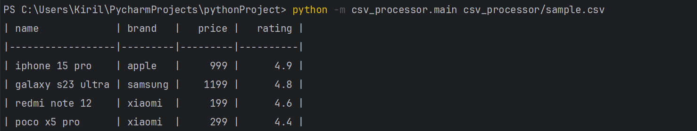
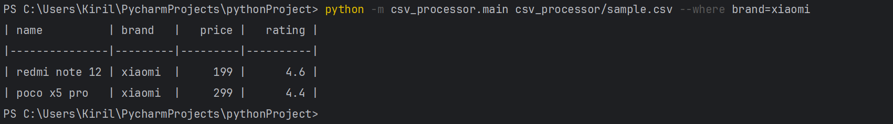
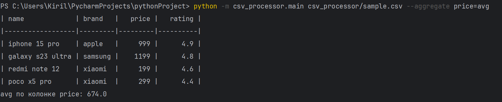
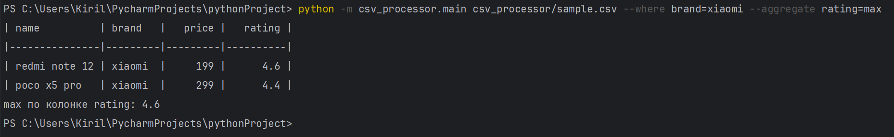

# CSV Processor

Скрипт для обработки CSV-файла с поддержкой фильтрации и агрегации по одной колонке.

## 📦 Установка зависимостей

```bash
pip install -r requirements.txt
```

## 🚀 Примеры запуска

### 📄 CSV-файл

Пример входного файла `sample.csv`:

```csv
name,brand,price,rating
iphone 15 pro,apple,999,4.9
galaxy s23 ultra,samsung,1199,4.8
redmi note 12,xiaomi,199,4.6
poco x5 pro,xiaomi,299,4.4
```



---

### 🔍 Фильтрация

```bash
python -m csv_processor.main sample.csv --where brand=xiaomi
```

Результат:



---

### 📊 Агрегация

```bash
python -m csv_processor.main sample.csv --aggregate price=avg
```

Результат:



---

### 🔀 Фильтрация + агрегация

```bash
python -m csv_processor.main sample.csv --where brand=xiaomi --aggregate rating=max
```

Результат:



---

## ✅ Тестирование

```bash
pytest --cov=csv_processor tests/
```